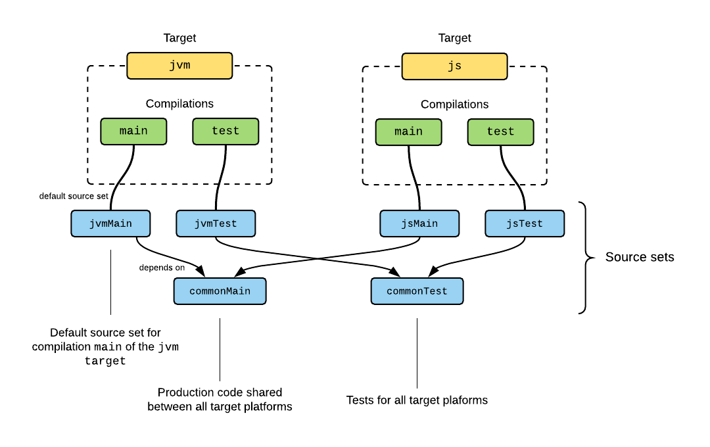
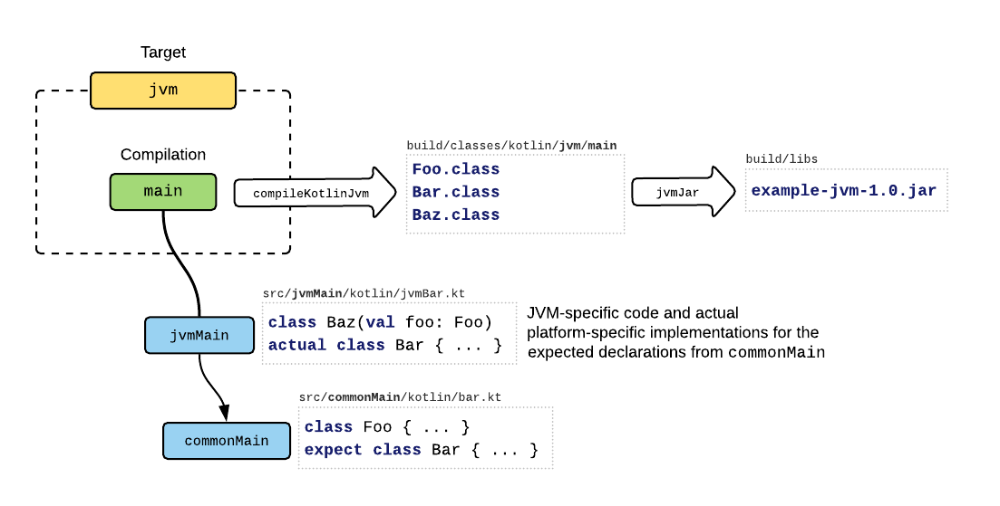

## 使用 Gradle 构建

**多平台项目是 Kotlin 1.2 和 1.3 中的实验性特性。本文档中描述的所有语言和工具功能都可能在将来的Kotlin版本中发生变更**

这篇文档解释了 [Kotlin 多平台项目](https://kotlinlang.org/docs/reference/multiplatform.html) 并且描述了gradle 中是如何配置的。

内容目录

- 项目结构
- 设置多平台项目
- gradle 插件
- 设置 Targets（目标）
    - 支持的平台
    - 配置编译
- 配置源集
    - 链接源集
    - 添加依赖
    - 语言设置
- 默认项目结构
- 运行测试
- 发布多平台库
- JVM 目标的Java 支持
- Android支持
    - 发布 Android 库
- 使用 Kotlin/Native 目标
    - 目标捷径
    - 构建最终native二进制

## 项目结构

Kotlin 多平台项目的结构由下面的构建块组成：

- [targets(目标)](https://kotlinlang.org/docs/reference/building-mpp-with-gradle.html#setting-up-targets) 是构建的一部分，负责构建，测试和打包用于其中一个平台的完整软件。因此，一个多平台项目通常包含多个目标。

- 建立每个目标涉及一次或多次编译 Kotlin 资源。 换句话说，目标可能具有一个或多个[编译](https://kotlinlang.org/docs/reference/building-mpp-with-gradle.html#configuring-compilations)。 例如，一个编译用于生产资源，另一个用于测试。

- Kotlin 资源被安排在[源集(源码集合)](https://kotlinlang.org/docs/reference/building-mpp-with-gradle.html#configuring-source-sets)中。 除了Kotlin源文件和资源外，每个源集可能都有自己的依赖性。 源集根据“依赖”关系构建层次结构。 源集本身与平台无关，但如果仅针对单个平台进行编译，则它可能包含特定于平台的代码和依赖项。

每个编译都有默认的源集，这部分用于设置特定于该编译的源和依赖项。 默认源集还用于通过“依赖”关系将其他源集定向到编译。

这是一个针对JVM和JS的项目的图示：



这里 `jvm` 和 `js`, 两个目标分别编译了生产和测试源，并且其中的一些源是共享的。 通过仅创建两个目标即可实现此布局，而无需为编译和源集进行其他配置：这些是为该目标构建的默认设置。

在上面的示例中，JVM目标的生产源通过其main编译进行编译，因此包括来自源集`jvmMain`和 `commonMain` 的源和依赖（由于取决于关系）：



这里，`jvmMain` 源集为共享 `commonMain` 源中的预期(expected)API提供了平台特定的实现。 这是在平台之间以灵活的方式在需要的地方使用特定于平台的实现方式共享代码的方式。

在后面章节中，将更详细地描述这些概念以及用于在项目中对其进行配置的DSL。

## 设置多平台项目

可以在IDE中创建一个新的多平台项目,在 "Kotlin" 下的“新建项目”对话框中选择一个多平台项目模板.

例如，如果选择 "Kotlin (Multiplatform Library)"，则会创建一个库项目，该项目具有三个目标，一个目标用于JVM，一个目标用于JS，一个目标用于正在使用的Native平台。 这些是通过以下方式在build.gradle脚本中配置的：

```Kotlin

plugins {
    kotlin("multiplatform") version "1.3.61"
}

repositories {
    mavenCentral()
}

kotlin {
    jvm() // Creates a JVM target with the default name 'jvm'
    js()  // JS target named 'js'
    mingwX64("mingw") // Windows (MinGW X64) target named 'mingw'
    
    sourceSets { /* ... */ }
}

```

这三个目标是使用预设函数jvm（），js（）和mingwX64（）创建的,它们各自有一些默认配置。 每个[受支持的平台](https://kotlinlang.org/docs/reference/building-mpp-with-gradle.html#supported-platforms)都有预设。

源集及其依赖通过如下配置：

```Kotlin
plugins { /* ... */ }

kotlin {
    /* Targets declarations omitted */

    sourceSets {
        val commonMain by getting {
            dependencies {
                implementation(kotlin("stdlib-common"))
            }
        }
        val commonTest by getting {
            dependencies {
                implementation(kotlin("test-common"))
                implementation(kotlin("test-annotations-common"))
            }
        }
        
        // Default source set for JVM-specific sources and dependencies:
        jvm().compilations["main"].defaultSourceSet {
            dependencies {
                implementation(kotlin("stdlib-jdk8"))
            }
        }
        // JVM-specific tests and their dependencies:
        jvm().compilations["test"].defaultSourceSet {
            dependencies {
                implementation(kotlin("test-junit"))
            }
        }
        
        js().compilations["main"].defaultSourceSet  { /* ... */ }
        js().compilations["test"].defaultSourceSet { /* ... */ }
        
        mingwX64("mingw").compilations["main"].defaultSourceSet { /* ... */ }
        mingwX64("mingw").compilations["test"].defaultSourceSet { /* ... */ }
    }
}
```

这些是上面配置目标生产和测试源的默认源集合。 源集commonMain和commonTest分别包含在所有目标的生产和测试编译中。 请注意，公共源集commonMain和commonTest的依赖项是公共的，平台相关库应该添加到特定目标的源集。

## Gradle 插件

Kotlin Multiplatform项目需要Gradle 4.7及更高版本，不支持较旧的Gradle版本。

要从零开始在Gradle项目中设置多平台项目，请首先在build.gradle文件的开头添加以下内容，将kotlin-multiplatform插件应用于该项目：

```Kotlin
plugins {
    kotlin("multiplatform") version "1.3.61"
}
```

这将在顶层创建 `kotlin` 扩展。接下来你就可以在构建脚本中使用它：

- 为多平台设置目标(默认是不会创建目标的)
- 配置源集和各自依赖

## 设置目标

目标是构建的一部分，负责编译，测试和打包针对某个受支持平台的软件。

所有目标都可以共享某些资源，也可以具有特定于平台的资源。

由于平台不同，目标也以不同的方式构建，并具有各种特定于平台的设置。 Gradle插件为支持的平台捆绑了许多预设。

要创建目标，请使用预设函数，这些函数根据目标进行命名，并可以选择接受目标名称和配置代码块：

```Kotlin
kotlin {
    jvm() // Create a JVM target with the default name 'jvm'
    js("nodeJs") // Create a JS target with a custom name 'nodeJs'
        
    linuxX64("linux") {
        /* Specify additional settings for the 'linux' target here */
    }
}
```

预设函数会根据目标函数是否存在返回目标,该返回可用于配置已存在目标:

```Kotlin
kotlin {
    /* ... */
    
    // Configure the attributes of the 'jvm6' target:
    jvm("jvm6").attributes { /* ... */ }
}
```

注意这里的目标平台和名字都很重要,如果目标是用 `jvm('jvm6')` 创建,再次使用 `jvm()` 会创建另一个mub(名字默认是 `jvm` ). 如果用于创建该名称下的目标的预设功能不同，则会报错。

从预设创建的目标将添加到kotlin.targets域对象集合中，该集合可用于按其名称访问它们或配置所有目标：


```kotlin
kotlin {
    jvm()
    js("nodeJs")
    
    println(targets.names) // Prints: [jvm, metadata, nodeJs]
    
    // Configure all targets, including those which will be added later:
    targets.all {
        compilations["main"].defaultSourceSet { /* ... */ }
    }
}
```

在多个预设中动态创建或者访问不同目标,可以使用 `targetFromPreset` 函数,该函数接收一个预设(包含在 `kotlin.presets` 域对象集合中),以及可选的,目标名字和一段配置代码块.

比如下面的代码,可以为所有 Kotlin/Native 支持的平台都创建一个目标:

```Kotlin
mport org.jetbrains.kotlin.gradle.plugin.mpp.KotlinNativeTargetPreset

/* ... */

kotlin {
    presets.withType<KotlinNativeTargetPreset>().forEach {
        targetFromPreset(it) { 
            /* Configure each of the created targets */
        }
    }
}
```

### 支持的平台

下面是一些预设目标,这些可以通过预设函数设置:

- `jvm` Kotlin/JVM 
- `js` Kotlin/JS
- `android` 安卓应用和库,注意在该目标创建前要先应用安卓 Gradle 插件.
- Kotlin/Native 预设目标(参看下面的[笔记](https://kotlinlang.org/docs/reference/building-mpp-with-gradle.html#using-kotlinnative-targets))
    - `androidNativeArm32` `androidNativeArm64` 对应安卓 NDK
    - `iosArm32` `iosArm64` `iosX64` 对应 iOS
    - `watchosArm32` `watchosArm64` `watchosX86` 对应 watchOS
    - `tvosArm64` `tvosX64` 对应 tvOS
    - `linuxArm32Hfp`, `linuxMips32`, `linuxMipsel32`, `linuxX64` 对应 linux
    - `macosX64` 对应 macOS
    - `mingwX64` `mingwX86` 对应 Windows
    - `wasm32` 对应 WebAssemnly

    注意这里有些 Kotlin/Native 目标需要[适当的硬件主机](https://kotlinlang.org/docs/reference/building-mpp-with-gradle.html#using-kotlinnative-targets)构建

一些目标需要附加的配置. 关于 Android 和 iOS 例子,可以参看[多平台项目:Android 和 iOS](https://kotlinlang.org/docs/tutorials/native/mpp-ios-android.html)教程

### 配置编译

构建目标需要一次或多次编译Kotlin。 目标的每个Kotlin编译都可以用于不同的目的（例如，生产代码，测试），并包含不同的源集。 可以在DSL中可以访问目标的编译，例如，获取任务，配置Kotlin编译器选项或获取依赖文件和编译输出：

```Kotlin
kotlin {
    jvm {
        val main by compilations.getting {
            kotlinOptions { 
                // Setup the Kotlin compiler options for the 'main' compilation:
                jvmTarget = "1.8"
            }
        
            compileKotlinTask // get the Kotlin task 'compileKotlinJvm' 
            output // get the main compilation output
        }
        
        compilations["test"].runtimeDependencyFiles // get the test runtime classpath
    }
    
    // Configure all compilations of all targets:
    targets.all {
        compilations.all {
            kotlinOptions {
                allWarningsAsErrors = true
            }
        }
    }
}
```

每个编译都附带一个默认源集，该默认源集存储特定于该编译的源和依赖项。 目标 `bar` 的编译 `foo` 的默认源集名字是 `barFoo` . 可以使用 `defaultSourceSet` 从编译中访问它：

```Kotlin
kotlin {
    jvm() // Create a JVM target with the default name 'jvm'
    
    sourceSets {
        // The default source set for the 'main` compilation of the 'jvm' target:
        val jvmMain by getting {
            /* ... */
        }
    }
    
    // Alternatively, access it from the target's compilation:
    jvm().compilations["main"].defaultSourceSet { 
        /* ... */
    }
}
```

要收集所有参与编译的源集，包括通过依赖关系添加的源集，可以使用属性 `allKotlinSourceSets` 。

对于某些特定用例，可能需要创建自定义编译。 这可以在目标的 `compilations` 域对象集合中完成。 请注意，需要为所有定制编译手动设置依赖项，并且定制编译输出的使用取决于构建作者。 例如，下面可以针对jvm（）目标的集成测试的定制编译：

```Kotlin
kotlin {
    jvm() {
        compilations {
            val main by getting

            val integrationTest by compilations.creating {
                defaultSourceSet {
                    dependencies {
                        // Compile against the main compilation's compile classpath and outputs:
                        implementation(main.compileDependencyFiles + main.output.classesDirs)
                        implementation(kotlin("test-junit"))
                        /* ... */
                    }
                }

                // Create a test task to run the tests produced by this compilation:
                tasks.create<Test>("integrationTest") {
                    // Run the tests with the classpath containing the compile dependencies (including 'main'),
                    // runtime dependencies, and the outputs of this compilation:
                    classpath = compileDependencyFiles + runtimeDependencyFiles + output.allOutputs

                    // Run only the tests from this compilation's outputs:
                    testClassesDirs = output.classesDirs
                }
            }
        }
    }
}
```

还要注意，默认情况下，自定义编译的默认源集既不依赖于commonMain也不依赖于commonTest。

## 配置源集

Kotlin 源集是 Kotlin源及其资源，依赖关系和语言设置的集合，这些源可能会参与一个或多个目标的Kotlin编译。

源集不限于平台特定的或“共享的”； 允许包含的内容取决于其用法：添加到多个编译中的源集仅限于通用语言功能和依赖项，而仅由单个目标使用的源集可以具有特定于平台的依赖项，并且其代码可以使用特定于目标平台的语言功能。

默认情况下会创建和配置一些源集：commonMain，commonTest和编译的默认源集。 请参阅默认项目结构。

源集在kotlin {...}扩展的sourceSets {...}块内配置：


```Kotlin
kotlin { 
    sourceSets { 
        val foo by creating { /* ... */ } // create a new source set by the name 'foo'
        val bar by getting { /* ... */ } // configure an existing source set by the name 'bar' 
    }
}
```

**注意：创建源集不会将其链接到任何目标。 一些源集是预定义的，因此会默认进行编译。 但是，自定义的源集必须明确指向编译,请参阅：[链接源集](https://kotlinlang.org/docs/reference/building-mpp-with-gradle.html#connecting-source-sets)。**

源集名称是大小写敏感的. 当通过名称引用默认源集时,确定前缀和目标名称匹配,比如源集 `iosX64Main` 对应 `iosX64`目标.

源集本身是平台无关的,但如果它只编译到某个平台则可以看做平台相关的. 源集可以既包含平台共享公共代码,也可以包含平台相关代码.

每个源集对于 Kotlin 源都有默认的源码目录: `src/<source set name>/kotlin` . 给源集添加 Kotlin 源码和资源,可以通过 `kotlin` `resource` 的 `SourceDirectorySet`:

默认源集的文件存储在如下目录:

- 源代码文件: `src/<source set name>/kotlin`
- 资源文件: `src/<source set name>/resources`

你需要手动创建这些目录

添加自定义 Kotlin 源码目录和资源目录可以通过以下方式:

```Kotlin
kotlin { 
    sourceSets { 
        val commonMain by getting {
            kotlin.srcDir("src")
            resources.srcDir("res")
        } 
    }
}
```

### 链接源集

Kotlin 源集可以通过依赖关系链接,如果源集 `foo` 依赖 源集`bar` 则会如下:

- 不论 `foo` 编译到任何平台, `bar` 都会参与到编译中,并会编译为目标二进制形式,比如 JVM class 文件或者 JS 代码
- 源集 `foo` 可以'看到' `bar` 的声明,也包括 `internal`声明,以及 `bar` 的依赖,尽管这些是通过 `implementation` 指定的依赖
- `foo` 可能包含针对 `bar` 的预期(expected)声明在特定于平台上的实现
- 源集 `bar` 总是与 `foo` 的资源一起处理和复制；
- `foo` `bar` 的语言设置应该是一致的

不允许源集循环依赖

源集的 DSL 可以定义源集间的链接:

```Kotlin
kotlin { 
    sourceSets { 
        val commonMain by getting { /* ... */ }
        val allJvm by creating {
            dependsOn(commonMain)
            /* ... */
        } 
    }
}
```

除了默认源集之外，还应将创建的自定义源集显式包含到依赖关系层次结构中，以便能够使用来自其他源集的声明，并且最重要的是可以参与编译。 大多数情况下，它们需要一个dependsOn（commonMain）或dependsOn（commonTest）语句，并且某些特定于平台的默认源集应直接或间接依赖于自定义源集：

```Kotlin
kotlin { 
    mingwX64()
    linuxX64()
    
    sourceSets {
        // custom source set with tests for the two targets
        val desktopTest by creating { 
            dependsOn(getByName("commonTest"))
            /* ... */
        }
        // Make the 'windows' default test source set for depend on 'desktopTest'
        mingwX64().compilations["test"].defaultSourceSet { 
            dependsOn(desktopTest)
            /* ... */
        }
        // And do the same for the other target:
        linuxX64().compilations["test"].defaultSourceSet {
            dependsOn(desktopTest)
            /* ... */
        }
    }
}
```

### 添加依赖

要将依赖项添加到源集，请使用源集DSL的 `dependencies { ... } ` 块。支持四种依赖项：

- `api` 依赖项在编译期间和运行时均会使用，并会导出到库使用者。如果当前模块的公共API中使用了依赖关系中的任何类型，则它应该是api依赖关系；

- `implementation` 依赖在当前模块的编译期间和运行时使用，但对其他模块通过 `implementation` 依赖当前模块时，不会导出该依赖。`implementation` 依赖关系类型应用于模块内部逻辑所需的依赖关系。如果模块是未发布的终结点应用程序，则它应该使用 `implementation` 而不是 `api` 依赖。

- `compileOnly` 依赖项仅用于编译当前模块，并且在运行时或其他模块的编译期间均不可用。这些依赖项应用于在运行时具有第三方实现的API。

- `runtimeOnlyOnly` 仅运行时可用，但在任何模块的编译过程中都不可见。

每个源集都指定了依赖种类，如下所示：

```Kotlin
kotlin {
    sourceSets {
        val commonMain by getting {
            dependencies {
                api("com.example:foo-metadata:1.0")
            }
        }
        val jvm6Main by getting {
            dependencies {
                api("com.example:foo-jvm6:1.0")
            }
        }
    }
}
```

注意，为了使IDE能够正确分析公共源的依赖关系，除了平台特定源集需要声明与平台特定组件依赖之外，公共源集还必须具有与 Kotlin 元数据包相对应的依赖关系。 通常，在使用已发布的库时（除非它与Gradle元数据一起发布，如下所述），需要后缀为-common（如kotlin-stdlib-common）或-metadata的组件。

然而 project（'...'）依赖于另一个多平台项目时会自动解析为适当的目标。 在源集的依赖项中指定单个project（'...'）依赖项就足够了，并且包含源集的编译将收到该项目的对应平台特定产物，只要它具有兼容的目标即可：

```Kotlin
kotlin {
    sourceSets {
        val commonMain by getting {
            dependencies {
                // All of the compilations that include source set 'commonMain'
                // will get this dependency resolved to a compatible target, if any:
                api(project(":foo-lib"))
            }
        }
    }
}
```

同样，如果以实验性 Gradle 元数据发布模式发布了多平台库，并且该项目也设置为使用元数据，那么只需为公共源集指定一次依赖项就足够了。 否则，除了公共模块之外，每个平台特定的源集还应提供库的相应平台模块，如上所示。

指定依赖关系的另一种方法是在顶层使用Gradle内置DSL，其配置名称遵循模式<sourceSetName> <DependencyKind>：

```Kotlin
dependencies {
    "commonMainApi"("com.example:foo-common:1.0")
    "jvm6MainApi"("com.example:foo-jvm6:1.0")
}
```

源集合依赖项DSL中不提供某些Gradle内置依赖项，例如 `gradleApi()` ,`localGroovy()`或`gradleTestKit()`。 但你可以将它们添加到顶级依赖项块中，如上所示。

可以使用 kotlin("stdlib") 添加像 `kotlin-stdlib` 或 `kotlin-reflect` 之类的Kotlin 依赖模块，这是 `org.jetbrains.kotlin：kotlin-stdlib` 的缩写。

### 语言设定

可以如下指定源集的语言设置：

```Kotlin
kotlin {
    sourceSets {
        val commonMain by getting {
            languageSettings.apply {
                languageVersion = "1.3" // possible values: '1.0', '1.1', '1.2', '1.3'
                apiVersion = "1.3" // possible values: '1.0', '1.1', '1.2', '1.3'
                enableLanguageFeature("InlineClasses") // language feature name
                useExperimentalAnnotation("kotlin.ExperimentalUnsignedTypes") // annotation FQ-name
                progressiveMode = true // false by default
            }
        }
    }
}
```

也可以为所有源集配置语言:

```Kotlin
kotlin.sourceSets.all {
    languageSettings.progressiveMode = true
}
```

源集的语言设置会影响在IDE中分析来源的方式。 由于当前的限制，在Gradle构建中，仅使用编译的默认源集的语言设置并将其应用于参与编译的所有源。

检查语言设置是否相互依赖，以确保源集之间的一致性。 即，如果 `foo` 依赖 `bar`：

- foo应该将languageVersion设置为大于或等于bar的语言；
- foo应该启用bar启用的所有不稳定的语言功能（错误修正功能没有这种要求）；
- foo应该使用bar使用的所有实验性注释；
- 可以任意设置apiVersion，错误修正语言功能和ProgressiveMode。

## 默认项目结构

默认情况下，每个项目都包含两个源集，`commonMain` 和 `commonTest`，在其中可以放置应在所有目标平台之间共享的所有代码。这些源集分别添加到各自生产和测试编译中。

添加目标后，将为其创建默认编译：

- 为 JAM,JS,以及原生目标创建 `main` 和 `test` 编译
- 针对Android目标的每个[Android构建变体](https://developer.android.com/studio/build/build-variants)的编译；

对于每个编译，在由 `<targetName> <CompilationName>` 组成的名称下都有一个默认源集。此默认源集参与了编译，因此应将其用于特定于平台的代码和依赖项，并通过“依赖于”的方式将其他源集添加到编译中。例如，目标为jvm6（JVM）和nodeJs（JS）的项目将具有源集：commonMain，commonTest，jvm6Main，jvm6Test，nodeJsMain，nodeJsTest。

默认用例集涵盖了绝大多数用例，不需要自定义用例集。

默认情况下，每个源集在 `src/<sourceSetName>/kotlin` 目录是Kotlin源码，在 `src/<sourceSetName>/resources下` 有资源文件。

在Android项目中，会为不同 [Android 源集](https://developer.android.com/studio/build/#sourcesets)创建对应的 Kotlin 源集。如果Android目标的名称为foo，则Android源集 bar 将会有 与Kotlin源集合对应的fooBar。但是，Kotlin编译能够从所有目录 `src/bar/java`，`src/bar/kotlin` 以及 ``src/foobar/kotlin`中使用Kotlin源。 Java源仅从这些目录中的第一个读取。

## 运行测试

JVM，Android，Linux，Windows和macOS当前默认支持在Gradle构建中运行测试。 JS和其他Kotlin/Native 目标需要手动配置以在适当的环境，模拟器或测试框架下运行测试。

每个适合测试的目标以名称 `<targetName>Test` 创建一个测试任务。`Check` 会运行所有目标的测试。

在将 `commonTest` 默认源集添加到所有测试编译后，所有目标平台上所需的测试和测试工具都可以添加在此处。

[kotlin.test API](https://kotlinlang.org/api/latest/kotlin.test/index.html) 可用于多平台测试。将 `kotlin-test-common` 和 `kotlin-test-annotations-common` 依赖项添加到 `commonTest` 以使用诸如 `kotlin.test.assertTrue（...）` 断言函数,以及 `@Test` / `@Ignore` / `@BeforeTest` / `@AfterTest` 等注解。

对于JVM目标，可以使用 `kotlin-test-junit` 或 `kotlin-test-testng` 用于相应的断言器实现和注解映射。

对于 Kotlin/JS 目标，添加 `kotlin-test-js` 作为测试依赖项。至此，创建了 Kotlin/JS 的测试任务，但默认情况下不运行测试。应该手动配置它们以使用JavaScript测试框架运行测试。

Kotlin/Native 目标不需要其他测试依赖项，内置了 `kotlin.test` API实现。

## 发布多平台库

可以使用 [maven-publish Gradle](https://docs.gradle.org/current/userguide/publishing_maven.html) 插件将由多平台项目构建的库发布到Maven存储库，该插件可以按以下方式使用：

```Kotlin
plugins {
    /* ... */
    id("maven-publish")
}
```

库还需要在项目中设置 `group` 和 `version`:

```Kotlin
plugins { /* ... */ }

group = "com.example.my.library"
version = "0.0.1"
```

与发布普通的 Kotlin/JVM 或 Java 项目相比，不需要通过 `publishing{...}` DSL手动创建发布。将自动为可在当前主机上构建的每个目标 创建发布，但Android目标除外，Android目标需要额外的步骤来配置发布，请参阅[发布Android库](https://kotlinlang.org/docs/reference/building-mpp-with-gradle.html#publishing-android-libraries)。

如 [Maven Publish插件](https://docs.gradle.org/current/userguide/publishing_maven.html#publishing_maven:repositories) 中所述，将通过 `publishing{...}` DSL中的 `repositories` 块添加将要发布库的存储库。

默认工件ID遵循如下格式 `<projectName>-<targetNameToLowerCase>` ，例如，`sample-lib-nodejs` 是指 `sample-lib` 中名为 `nodeJs` 的目标.

默认情况下，除了其主要工件之外，还将源JAR添加到每个发布中。源JAR包含目标`main`编译所使用的源。如果还需要发布文档工件（如Javadoc JAR），则需要手动配置其构建并将其作为工件添加到相关发布中，像下面这样。

另外，默认情况下会添加一个名为 `metadata` 的附加发布，其中包含序列化的 Kotlin 声明，并且IDE可以使用它来分析多平台库。该发布的默认工件ID形成为 `<projectName>-metadata`。

可以更改Maven，并且可以将其他工件文件添加到 `targets { ... }` 块或  `publishing{...}` DSL中：

```Kotlin
kotlin {
    jvm("jvm6") {
        mavenPublication { // Setup the publication for the target 'jvm6'
            // The default artifactId was 'foo-jvm6', change it:  
            artifactId = "foo-jvm"
            // Add a docs JAR artifact (it should be a custom task): 
            artifact(jvmDocsJar)
        }
    }
}

// Alternatively, configure the publications with the `publishing { ... }` DSL:
publishing {
    publications.withType<MavenPublication>().apply {
        val jvm6 by getting { /* Setup the publication for target 'jvm6' */ }
        val metadata by getting { /* Setup the publication for Kotlin metadata */ }
    }
}
```

由于组装 Kotlin/Native 工件需要在不同的主机平台上运行的多个版本，因此发布包含 Kotlin/Native  目标的多平台库需要使用同一套主机完成。 为了避免重复发布可以在多个平台（例如JVM，JS，Kotlin元数据，WebAssembly）上构建的模块，可以将这些模块的发布任务配置为有条件地运行。

这个简化的示例确保仅在将 `-PisLinux = true` 传递到命令行中的构建时，才上载JVM，JS和Kotlin元数据发布：

```Kotlin
kotlin {
    jvm()
    js()
    mingwX64()
    linuxX64()
       
    // Note that the Kotlin metadata is here, too. 
    // The mingwx64() target is automatically skipped as incompatible in Linux builds.
    configure(listOf(metadata(), jvm(), js())) {
        mavenPublication { 
            val targetPublication = this@mavenPublication
            tasks.withType<AbstractPublishToMaven>()
                .matching { it.publication == targetPublication }
                .all { onlyIf { findProperty("isLinux") == "true" } }            
        }
    }
}
```

### 实验性元数据发布模式

Gradle模块元数据提供了丰富的发布和依赖关系解析功能，这些功能在Kotlin多平台项目中使用，可简化构建作者的依赖关系配置。特别是，多平台库的出版物可能包括一个特殊的 root 模块，该模块代表整个库，并在作为依赖项添加时自动解析为适当的特定于平台的工件，如下所述。

在Gradle 5.3及更高版本中，模块元数据始终在依赖关系解析期间使用，但默认情况下发布不包含任何模块元数据。要启用模块元数据发布，请将 `enableFeaturePreview("GRADLE_METADATA")` 添加到根项目的settings.gradle文件中。对于较旧的Gradle版本，模块元数据消费也需要此功能。

请注意，Gradle 5.3及更高版本发布的模块元数据不能被5.3之前的Gradle版本读取。

启用Gradle元数据后，会将名为 `kotlinMultiplatform` “root” 发布添加到项目的发布中。该发布的默认工件(artifact)ID与项目名称匹配，没有任何其他后缀。要配置此发布，请通过 `maven-publish` 插件的 `publishing{...}` DSL操作：

```Kotlin
kotlin { /* ... */ }

publishing {
    publications {
        val kotlinMultiplatform by getting {
            artifactId = "foo"        
        }
    }
}
```

该出发布不包含任何工件(artifact)，仅引用其他发布作为其变体。 但是，如果存储库需要，则可能需要源和文档工件。 在这种情况下，请使用发布区域内使用artifact（...）添加这些工件，如上所示进行访问。

如果某个库具有 “root” 发布，则使用者可以在一个通用源集中指定对整个库的单个依赖项，并且将为包括以下内容的每个编译选择一个对应的特定于平台的变体（如果有）。下面的 `sample-lib` 就是一个以作为 root 发布的面向JVM和JS构建的示例库：

```kotlin
kotlin {
    jvm("jvm6")
    js("nodeJs")
        
    sourceSets {
        val commonMain by getting {
            dependencies {
                // This single dependency is resolved to the appropriate target modules, 
                // for example, `sample-lib-jvm6` for JVM, `sample-lib-js` for JS:
                api("com.example:sample-lib:1.0") 
            }
        }
    }
}
```

这要求使用者的 Gradle 构建能够读取 Gradle 模块的元数据,要么使用 Gradle 5.3+ ,要么在 `settings.gradle` 中显示声明 `enableFeaturePreview("GRADLE_METADATA")`

###明确构建目标

在多平台库中，单个平台可能有多个目标。例如，这些目标可以提供相同的API，但在运行时与它们交互的库（例如测试框架或日志记录解决方案）不同。

但是，对这种多平台库的依赖性可能是模棱两可的，因此可能无法解决，因为没有足够的信息来决定选择哪个目标。

解决方案是用自定义属性标记目标，Gradle在依赖关系解析过程中会考虑到该属性。但是，这必须在库作者和使用者方面同时进行，库作者有责任将属性及其可能的值传达给使用者。

添加属性时需要对称添加,需要在库和使用项目中对称添加. 比如,在一个测试库中,在两个目标中都支持JUnit和TestNG。库作者需要向两个目标添加一个属性，如下所示：

```Kotlin
val testFrameworkAttribute = Attribute.of("com.example.testFramework", String::class.java)
  
kotlin {
    jvm("junit") {
        attributes.attribute(testFrameworkAttribute, "junit")
    }
    jvm("testng") {
        attributes.attribute(testFrameworkAttribute, "testng")
    }
}
```

使用者只需要只需要将属性添加到产生歧义的单个目标即可。

如果将依赖项添加到自定义配置而不是插件创建的配置之一时出现了相同的歧义，则可以通过相同的方式将属性添加到配置中：


```Kotlin
val testFrameworkAttribute = Attribute.of("com.example.testFramework", String::class.java)

configurations {
    val myConfiguration by creating {
        attributes.attribute(testFrameworkAttribute, "junit")
    }
}
```

## JVM 目标中的 Java 支持

从Kotlin 1.3.40开始，此功能可用。

默认情况下，JVM目标会忽略Java源代码，仅编译Kotlin源文件。
要将Java源代码包含在JVM目标的编译中，或应用要求Java插件起作用的Gradle插件，需要显式启用对目标的Java支持：

```Kotlin
kotlin {
    jvm {
        withJava()
    } 
}
```

这可以调用 Gradle Java 插件并配置目标与之交互。注意，仅应用Java插件而不在JVM目标中指定withJava（）不会对目标产生影响。

Java源文件系统的位置与Java插件的默认位置不同。 Java源文件需要放置在Kotlin源根目录的同级目录中。例如，如果JVM目标具有默认名称jvm，则路径为：

```Kotlin
src
├── jvmMain
│   ├── java // production Java sources
│   ├── kotlin
│   └── resources
├── jvmTest
│   ├── java // test Java sources
│   ├── kotlin
…   └── resources
```

通用源集不能包括Java源。

由于当前的限制，禁用了Java插件配置的某些任务，而使用了Kotlin插件添加的相应任务：

- 禁用 `jar` 以便支持目标的JAR任务（例如jvmJar）
- 禁用 `test`，并使用目标的测试任务（例如jvmTest）
- `* ProcessResources` 任务被禁用，并且资源由编译的等效任务处理

该目标的发布由Kotlin插件处理，不需要特定于 Java 插件的步骤，例如手动创建发布并将其配置为 `from（components.java）`.

## Android 支持

Kotlin Multiplatform项目通过提供android预设来支持Android平台。创建Android目标需要手动将一个Android Gradle插件（例如com.android.application或com.android.library）应用到项目。每个Gradle子项目只能创建一个Android目标：

```Kotlin
plugins {
    id("com.android.library")
    kotlin("multiplatform").version("1.3.61")
}

android { /* ... */ }

kotlin {
    android { // Create the Android target
        // Provide additional configuration if necessary
    }
}
```

默认情况下创建的Android目标的编译与[Android构建变体](https://developer.android.com/studio/build/build-variants)相关：对于每个构建变体，均以相同的名称创建Kotlin编译。

然后，对于由变体编译的每个Android源集，将在目标名称前的源集名称下创建Kotlin源集，例如Kotlin源集 `androidDebug` 是为Android 源集 `debug` 和名为android的Kotlin目标。这些Kotlin源集将相应地添加到变体编辑中。

默认的源集commonMain被添加到每个生产（应用程序或库）变体的编译中。同样，将commonTest源集添加到单元测试和检测测试变体的编译中。

还支持使用 [kapt](https://kotlinlang.org/docs/reference/kapt.html) 进行注释处理，但是由于当前的限制，它要求在配置kapt依赖项之前创建Android目标，这需要在最外层 `depedencies{...}` 块中完成，而不是在内部Kotlin源设置依赖项。

```Kotlin
// ...

kotlin {
    android { /* ... */ }
}

dependencies {
    kapt("com.my.annotation:processor:1.0.0")
}
```

### 发布Android库

要将Android库发布为多平台库的一部分，需要设置该库的发布并为Android库目标提供其他配置。

默认情况下，不发布Android库的任何工件。要发布由一组Android变体产生的工件，请在Android目标块中指定变体名称，如下所示：

```Kotlin
kotlin {
    android {
        publishLibraryVariants("release", "debug")
    }
}
```

上面的示例适用于没有产品特性的Android库。对于具有产品特性的库，变体名称也包含样式，例如fooBarDebug或fooBazRelease。

请注意，如果库使用者定义了库中缺少的变体，则它们需要提供匹配和回滚。例如，如果库不具有或不发布 `staging` 构建类型，则必须为具有这种构建类型的使用者提供备用，并至少指定该库发布的构建类型之一：

```Kotlin
android {
    buildTypes {
        val staging by creating {
            // ...
            matchingFallbacks = listOf("release", "debug") 
        }
    }
}
```

类似地，如果库发布中缺少某些特性，则库使用者可能需要为定制产品特性提供匹配的回滚。

可以选择发布按产品特性分组的变体，以便将不同构建类型的输出放置在单个模块中，并使构建类型成为工件的分类器（发布构建类型仍未发布而没有分类器）。此模式默认情况下处于禁用状态，可以按以下方式启用：

```Kotlin
kotlin {
    android {
        publishLibraryVariantsGroupedByFlavor = true
    }
}
```

如果它们具有不同的依赖性，则不建议发布按产品特性分组的变体，因为这些变体将合并到一个依赖列表中。

## 使用 Kotlin/Native 目标

需要特别注意某些 Kotlin/Native 目标只能使用适当的主机构建：

- Linux MIPS目标（linuxMips32和linuxMipsel32）需要Linux主机。可以在任何受支持的主机上构建其他Linux目标。
- Windows目标需要Windows主机；
- macOS和iOS目标只能在macOS主机上构建；
- 64位 Android Native 目标需要Linux或macOS主机。可以在任何受支持的主机上构建32位 Android Native目标。

当前主机不支持的目标在构建期间将被忽略，不会发布。库作者可能希望按照库目标平台的要求从不同的主机上进行构建和发布。

### 目标快捷方式

某些 native 目标通常一起创建并使用相同的源。例如，为iOS设备和模拟器进行构建由不同的目标（分别为iosArm64和iosX64）表示，但它们的源代码通常相同。在多平台项目模型中表达此类共享代码的一种规范方法是创建一个中间源集（iosMain）并配置它与平台源集之间的链接：

```Kotlin
val commonMain by sourceSets.getting
val iosDeviceMain by sourceSets.getting
val iosSimulatorMain by sourceSets.getting

val iosMain by sourceSets.creating {
    dependsOn(commonMain)
    iosDeviceMain.dependsOn(this)
    iosSimulatorMain.dependsOn(this)
}
```

从1.3.60版本开始，`kotlin-multiplaform` 插件提供了可自动执行此类配置的快捷方式：他们允许用户使用单个DSL方法为用户创建一组目标以及一个通用源集。

可以使用以下快捷方式：

- `ios` 为 `iosArm64` 和 `iosX64` 创建目标。
- `watchos` 为 `watchosArm32`，`watchosArm64` 和 `watchosX86` 创建目标。
- `tvos` 为 `tvosArm64` 和 `tvosX64` 创建目标。

```Kotlin
// Create two targets for iOS.
// Create common source sets: iosMain and iosTest.
ios {
    // Configure targets.
    // Note: this lambda will be called for each target.
}

// You can also specify a name prefix for created targets.
// Common source sets will also have this prefix:
// anotherIosMain and anotherIosTest.
ios("anotherIos")
```

### 构建最终的 native 二进制文件

默认情况下，Kotlin/Native目标被编译为 *.klib，Kotlin/Native 本身可以将其作为依赖项使用，但不能执行或用作 native 库。要声明最终的 native 二进制文件（如可执行文件或共享库），请使用 native 目标的 `binaries` 属性。除了默认的 *.klib工件之外，此属性还代表为此目标构建的本机二进制文件的集合，并提供了一组声明和配置它们的方法。

请注意，默认情况下，`kotlin-multiplaform` 插件不会创建任何生产二进制文件。默认情况下，唯一可用的二进制文件是调试可执行文件，该文件允许运行来自测试编译的测试。

#### **声明二进制**

一组工厂方法用于声明 `binaries` 集合的元素。这些方法允许指定创建的二进制类型并对其进行配置。支持以下二进制种类（请注意，并非所有种类都可用于所有native平台）：

| 工厂方法 | 二进制种类 | 可用于 |
| ---- | ---- | ---- |
| excutable | 用于生产的可执行文件 | 所有 native 目标 |
| test | 用于 test 的可执行文件  |  所有 native 目标 |
| sharedLib | 共享的 native 库 |  所有 native 目标除了 wasm32 |
| staticLib | 静态 native 库 |  所有 native 目标除了 wasm32 |
| framework  | Objective-C framework  |  只用于 macOS, iOS, watchOS, tvOS 目标 |

每个工厂方法都有多个版本。通过 `executable` 方法示例学习使用它们。所有相同的版本对于所有其他工厂方法均可使用。

最简单的版本不需要任何其他参数，并为每种构建类型创建一个二进制文件。当前有两种可用的构建类型：DEBUG（产生带有调试信息的未优化的二进制文件）和RELEASE（产生没有调试信息的已优化的二进制文件）。因此，以下代码段创建了两个可执行二进制文件：debug和release。

```Kotlin
kotlin {
    linuxX64 { // Use your target instead.
        binaries {
            executable {
                // Binary configuration.
            }
        }
    }
}
```

上例中的 `executable` 方法接受的lambda表达式将应用于所创建的每个二进制文件，并允许其配置二进制文件（请参见相应部分）。请注意，如果不需要其他配置，则可以删除此lambda：

```Kotlin
binaries {
    executable()
}
```

可以指定将使用哪些构建类型来创建二进制文件，而不使用哪些构建类型。在以下示例中，仅创建调试可执行文件。

```Kotlin
binaries {
    executable(listOf(DEBUG)) {
        // Binary configuration.
    }
}
```
最后一个工厂方法版本允许自定义二进制名称。

```Kotlin
binaries {
    executable("foo", listOf(DEBUG)) {
        // Binary configuration.
    }

    // It's possible to drop the list of build types (all the available build types will be used in this case).
    executable("bar") {
        // Binary configuration.
    }
}
```

在此示例中，第一个参数允许为所创建的二进制文件设置名称前缀，该名称前缀用于在构建脚本中访问它们（请参阅[“访问二进制文件”](https://kotlinlang.org/docs/reference/building-mpp-with-gradle.html#accessing-binaries)部分）。此前缀也用作二进制文件的默认名称。例如，在Windows上，以上示例生成文件foo.exe和bar.exe。

### **访问二进制文件**

二进制 DSL 不仅允许创建二进制文件，还可以访问已创建的二进制文件以配置它们或获取其属性（例如，输出文件的路径）。 `binaries` 集合实现 [`DomainObjectSet`](https://docs.gradle.org/current/javadoc/org/gradle/api/DomainObjectSet.html) 接口，并提供 `all` 或 `matching` 方法，允许配置元素组。

也有可以获得集合的某个元素。有两种方法可以做到这一点。首先，每个二进制文件都有一个唯一的名称。该名称基于名称前缀（如果已指定），构建类型和二进制种类，根据以下模式：`<optional-name-prefix><build-type><binary-kind>` ，例如 `releaseFramework` 或 `testDebugExecutable`。

注意：静态库和共享库的后缀分别为 Static 和 Shared，例如 fooDebugStatic 或 barReleaseShared

此名称可用于访问二进制文件：

```Kotlin
// Fails if there is no such a binary.
binaries["fooDebugExecutable"]
binaries.getByName("fooDebugExecutable")

 // Returns null if there is no such a binary.
binaries.findByName("fooDebugExecutable")
```


第二种方法是使用类型化的获取器(getter) 。这些获取器允许通过其名称前缀和构建类型来访问某种类型的二进制文件。

```Kotlin
// Fails if there is no such a binary.
binaries.getExecutable("foo", DEBUG)
binaries.getExecutable(DEBUG)          // Skip the first argument if the name prefix isn't set.
binaries.getExecutable("bar", "DEBUG") // You also can use a string for build type.

// Similar getters are available for other binary kinds:
// getFramework, getStaticLib and getSharedLib.

// Returns null if there is no such a binary.
binaries.findExecutable("foo", DEBUG)

// Similar getters are available for other binary kinds:
// findFramework, findStaticLib and findSharedLib.
```

### **配置二进制文件**

二进制文件具有一组属性，以下选项可用于配置：

- **Compliation** 每个二进制文件都是基于同一目标中可用的一些编译构建的。此参数的默认值取决于二进制类型：测试二进制基于 `test` 编译，而其他二进制基于 `main` 编译。

- **Linker options** 选项在二进制构建过程中传递给系统链接器。可以使用此设置链接到某些 native 库。

- *Output file name* 默认情况下，输出文件名基于二进制名称前缀，或者，如果未指定名称前缀，则基于项目名称。但是可以使用baseName属性独立配置输出文件名。请注意，最终文件名将通过在该基本名称中添加与系统相关的前缀和后缀来形成。例如。将为基本名称为foo的Linux共享库生成libfoo.so。

- **Entry point** （仅适用于可执行二进制文件）默认情况下，Kotlin/Native 程序的入口点是位于根包中的 `main` 方法。此设置允许更改此默认设置，并使用自定义函数作为入口点。例如，可以使用它从根包中移出 `main` 方法。
- **Access to the output file**

- **Access to a link task**

- **Access to a run task**（仅适用于可执行二进制文件）。 `kotlin-multiplatform` 插件为 native 平台（Windows，Linux和macOS）的所有可执行二进制文件创建运行任务。此类任务的名称基于二进制名称，例如 `runReleaseExecutable<target-name>` 或者 `runFooDebugExecutable<target-name>`。可以使用可执行二进制文件的 `runTask` 属性访问运行任务。

- **Framework type**（仅适用于Objective-C框架） 默认情况下，由Kotlin/Native 构建的框架包含一个动态库。但是可以用静态库替换它。

以下示例显示如何使用这些设置。

```Kotlin
binaries {
    executable("my_executable", listOf(RELEASE)) {
        // Build a binary on the basis of the test compilation.
        compilation = compilations["test"]

        // Custom command line options for the linker.
        linkerOpts = mutableListOf("-L/lib/search/path", "-L/another/search/path", "-lmylib")

        // Base name for the output file.
        baseName = "foo"

        // Custom entry point function.
        entryPoint = "org.example.main"

        // Accessing the output file.
        println("Executable path: ${outputFile.absolutePath}")

        // Accessing the link task.
        linkTask.dependsOn(additionalPreprocessingTask)

        // Accessing the run task.
        // Note that the runTask is null for non-host platforms.
        runTask?.dependsOn(prepareForRun)
    }

    framework("my_framework" listOf(RELEASE)) {
        // Include a static library instead of a dynamic one into the framework.
        isStatic = true
    }
}
```

### 在框架中导出依赖项

在构建 Objective-C 框架时，通常不仅要打包当前项目的类，还要打包其某些依赖项的类。 Binaries DSL允许使用 `export` 方法来指定将在框架中导出哪些依赖项。请注意，只能导出相应源集的API依赖项。

```Kotlin
kotlin {
    sourceSets {
        macosMain.dependencies {
            // Will be exported in the framework.
            api(project(":dependency"))
            api("org.example:exported-library:1.0")

            // Will not be exported in the framework.
            api("org.example:not-exported-library:1.0")
        }
    }

    macosX64("macos").binaries {
        framework {
            export(project(":dependency"))
            export("org.example:exported-library:1.0")
        }
    }
}
```

如本例所示，还可以导出maven依赖项。但是由于Gradle元数据的当前限制，这种依赖关系应该是平台依赖项(例如kotlinx-coroutines-core-native_debug_macos_x64 而不是 kotlinx-coroutines-core-传递性地导出（请参见下文）。

默认情况下，导出工作是非传递的。如果导出了依赖于库 `bar` 的库 `foo` ，则只会在输出框架中添加 foo 。可以通过 `transitiveiveExport` 标志更改此行为。

```Kotlin
binaries {
    framework {
        export(project(":dependency"))
        // Export transitively.
        transitiveExport = true
    }
}
```

### **建立通用框架**

默认情况下，由Kotlin / Native生产的Objective-C框架仅支持一个平台。但是，可以使用 `lipo` 实用程序将此类框架合并为单个通用（富）二进制文件。特别是，这种操作对于32位和64位iOS框架是有意义的。在这种情况下，最终的通用框架可以在32位和64位设备上使用。

Gradle插件提供了一个单独的任务，该任务从多个常规目标为iOS目标创建通用框架。下面的示例显示如何使用此任务。请注意，富框架必须具有与初始框架相同的基本名称。

```Kotlin
import org.jetbrains.kotlin.gradle.tasks.FatFrameworkTask

kotlin {
    // Create and configure the targets.
    val ios32 = iosArm32("ios32")
    val ios64 = iosArm64("ios64")

    configure(listOf(ios32, ios64)) {
        binaries.framework {
            baseName = "my_framework"
        }
    }

    // Create a task building a fat framework.
    tasks.create("debugFatFramework", FatFrameworkTask::class) {
        // The fat framework must have the same base name as the initial frameworks.
        baseName = "my_framework"

        // The default destination directory is '<build directory>/fat-framework'.
        destinationDir = buildDir.resolve("fat-framework/debug")

        // Specify the frameworks to be merged.
        from(
            ios32.binaries.getFramework("DEBUG"),
            ios64.binaries.getFramework("DEBUG")
        )
    }
}
```
CInterop支持

由于Kotlin/Native提供了[与 native 语言的互操作性](https://kotlinlang.org/docs/reference/native/c_interop.html)，因此有DSL允许人们为特定的编译配置此功能。

编译可以与多个本机库交互。可以在编译的 `cinterops` 块中配置与它们每个的互操作性：

```Kotlin
kotlin {
    linuxX64 {  // Replace with a target you need.
        compilations.getByName("main") {
            val myInterop by cinterops.creating {
                // Def-file describing the native API.
                // The default path is src/nativeInterop/cinterop/<interop-name>.def
                defFile(project.file("def-file.def"))

                // Package to place the Kotlin API generated.
                packageName("org.sample")

                // Options to be passed to compiler by cinterop tool.
                compilerOpts("-Ipath/to/headers")

                // Directories to look for headers.
                includeDirs.apply {
                    // Directories for header search (an analogue of the -I<path> compiler option).
                    allHeaders("path1", "path2")

                    // Additional directories to search headers listed in the 'headerFilter' def-file option.
                    // -headerFilterAdditionalSearchPrefix command line option analogue.
                    headerFilterOnly("path1", "path2")
                }
                // A shortcut for includeDirs.allHeaders.
                includeDirs("include/directory", "another/directory")
            }

            val anotherInterop by cinterops.creating { /* ... */ }
        }
    }
}
```

通常，需要为使用 native 库的二进制文件指定特定于目标的链接器选项。 可以通过使用二进制文件的 linkerOpts 属性来完成。 有关详细信息，请参见“配置二进制文件”部分。
