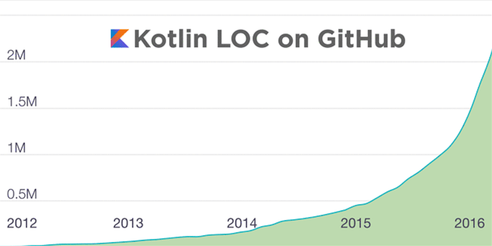

2015.3.4

gitbook 墙内访问速度很糟糕 现在有了[墙内地址](http://kotlindoc.com/)啦 :)

国内服务器由[掘金](http://gold.xitu.io)赞助

稀土掘金：挖掘最优质的互联网技术 / 联合编辑每日精选内容 / 移动端优质阅读体验

本书源码在 [github](https://github.com/huanglizhuo/kotlin-in-chinese) 

记得要点 star star star

发现有翻译的不好的或者错误欢迎到 github 提 [issue](https://github.com/huanglizhuo/kotlin-in-chinese/issues/new)

##号外 号外 Kotlin 1.0 正式发布

Android 世界的 Swift 终于发布1.0版本 

Kotlin 是一个实用性很强的语言，专注于互通，安全，简洁，工具健全...

无缝支持 Java+Kotlin 项目，可以更少的使用样版代码，确保类型安全。

[Kotlin 1.0 更新日志](http://blog.jetbrains.com/kotlin/2016/02/kotlin-1-0-released-pragmatic-language-for-jvm-and-android/)

还换了logo :)

Kotlin LOC (软件规模代码行) 如下图

近期我会重新读一遍 Kotlin 官方文档 并对现在的这份文档进行更新(又立 flag 了) -- 2016.2.16

* [准备开始](GettingStarted/README.md) 
   * [基本语法](GettingStarted/Basic-Syntax.md) 
   * [习惯用语](GettingStarted/Idioms.md) 
   * [编码风格](GettingStarted/Coding-Conventions.md) 

* [基础](Basics/README.md) 
   * [基本类型](Basics/Basic-Types.md)
   * [包](Basics/Packages.md)
   * [控制流](Basics/Contro-lFlow.md)
   * [返回与跳转](Basics/Returns-and-Jumps.md)

* [类和对象](ClassesAndObjects/README.md)
   * [类和继承](ClassesAndObjects/Classes-and-Inheritance.md)　
   * [属性和字段](ClassesAndObjects/Properties-and-Filds.md)　
   * [接口](ClassesAndObjects/Interfaces.md) 
   * [可见性修饰词](ClassesAndObjects/Visibility-Modifiers.md) 
   * [扩展](ClassesAndObjects/Extensions.md) 
   * [数据对象](ClassesAndObjects/Data-Classes.md) 
   * [泛型](ClassesAndObjects/Generics.md)
   * [嵌套类](ClassesAndObjects/NestedClasses.md) 
   * [枚举类](ClassesAndObjects/EnumClasses.md) 
   * [对象表达式和声明](ClassesAndObjects/ObjectExpressicAndDeclarations.md) 
   * [代理模式](ClassesAndObjects/Delegation.md) 
   * [代理属性](ClassesAndObjects/DelegationProperties.md) 

* [函数和lambda表达式](FunctionsAndLambdas/README.md)
   * [函数](FunctionsAndLambdas/Functions.md) 
   * [高级函数和lambda表达式](FunctionsAndLambdas/Higher-OrderFunctionsAndLambdas.md) 
   * [内联函数](FunctionsAndLambdas/InlineFunctions.md) 

* [其它](Other/README.md)
   * [多重申明](Other/Multi-Declarations.md) 
   * [Ranges](Other/Ranges.md) 
   * [类型检查和自动转换](Other/Type-Checks-and-Casts.md) 
   * [This表达式](Other/This-Expression.md) 
   * [等式](Other/Equality.md) 
   * [运算符重载](Other/Opetator-overloading.md) 
   * [空安全](Other/Null-Safety.md) 
   * [异常](Other/Exceptions.md) 
   * [注解](Other/Annotations.md) 
   * [反射](Other/Reflection.md) 
   * [动态类型](Other/Dynamic-Type.md) 

* [参考](Reference/README.md)
    * [API](Reference/API-Reference.md) 
    * [语法](Reference/Grammar.md)
* [互用性](Interop/README.md)
   * [与 java 交互](Interop/Java-Interop.md)

* [工具](Tools/README.md) 
   * [Kotlin代码文档](Tools/Documenting-Kotlin-Code.md)
   * [使用Maven](Tools/Using-Maven.md) 
   * [使用Ant](Tools/Using-Ant.md) 
   * [使用Griffon](Tools/Using-Griffon.md) 
   * [使用Gradle](Tools/Using-Gradle.md)　

* [FAQ](FAQ/README.md)
   * [与java对比](FAQ/Comparison2java.md) 
   * [与Scala对比](FAQ/Comparison2Scala.md) 
